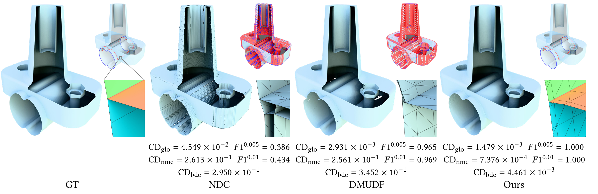
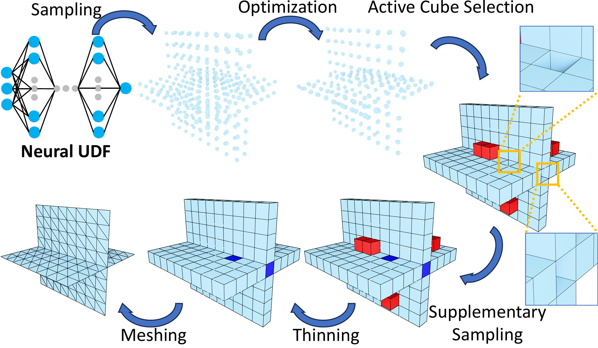

```markdown
<div align="center">
  <h1>🧊 DCx</h1>
  <p>
    <b>Dual Contouring over Expanded Cubes (DCx) for Zero-Level Set Extraction from Neural Unsigned Distance Functions</b><br>
    <i>(ACM SIGGRAPH 2026)</i>
  </p>

  <p>
    <a href="https://github.com/jjjkkyz/DCx/blob/main/LICENSE"></a>
    
    
    
  </p>
  
  <!-- [TODO: 请在此处插入一张最能代表你们工作成果的 Teaser 图] -->
  <!-- 建议图片宽度设置为 100% 或 800px -->
  
  <p><em>Extraction of complex non-manifold structures using DCx from Unsigned Distance Functions.</em></p>
</div>

---

## 📝 About

This repository contains the official implementation of the SIGGRAPH 2026 paper: **"Dual Contouring over Expanded Cubes (DCx) for Zero-Level Set Extraction from Neural Unsigned Distance Functions"**. 

DCx provides a robust framework to extract high-quality, non-manifold zero-level sets from both Ground Truth and Neural Unsigned Distance Functions (UDFs).

## ⚙️ Methodology Pipeline

<!-- [TODO: 请在此处插入算法Pipeline图] -->
<div align="center">
  
  <p><em>Overview of the DCx pipeline: from UDF sampling to the final mesh extraction via Expanded Cubes.</em></p>
</div>

## 🖼️ Gallery & Results

<!-- [TODO: 请在此处插入几张结果对比图，或者多视图结果] -->
<div align="center">
  <table>
    <tr>
      <!-- 你可以根据需要增加或减少 <td> 标签来并排显示图片 -->
      <td></td>
      <td></td>
    </tr>
    <tr>
      <td></td>
      <td></td>
    </tr>
  </table>
  <p><em>Visual comparison of extracted meshes using our proposed DCx algorithm.</em></p>
</div>

---

## 🛠️ Environment Setup

We recommend using [Conda](https://docs.conda.io/en/latest/miniconda.html) to manage your environment. Follow the steps below to set up the dependencies:

```bash
# 1. Create and activate a new conda environment
conda create -n dcx python=3.9 -y
conda activate dcx

# 2. Install PyTorch with CUDA 11.8
conda install pytorch==2.2.1 torchvision==0.17.1 torchaudio==2.2.1 pytorch-cuda=11.8 -c pytorch -c nvidia

# 3. Install CUDA toolkit and related packages for CAPUDF
conda install -c nvidia cuda-toolkit=11.8 cuda-nvcc=11.8 cuda-cccl=11.8 -y

# 4. Install other Python dependencies
pip install open3d scikit-image tqdm pyhocon==0.3.57 trimesh PyMCubes scipy point_cloud_utils==0.29.7

# 5. Install DCx
cd DCX
pip install .
```

### Additional Extensions

**CAPUDF:** We use [CAPUDF](https://github.com/junshengzhou/CAP-UDF) to compute Neural Unsigned Distance Functions (NUDF). You need to compile the Chamfer Distance extension first:
```bash
cd CAPUDF/extensions/chamfer_dist
python setup.py install
```

**cubvh:** We use [cubvh](https://github.com/ashawkey/cubvh) to compute Ground Truth Unsigned Distance Functions (GTUDF). Install it directly via git:
```bash
pip install git+https://github.com/ashawkey/cubvh --no-build-isolation
```

## 📁 Directory Structure

```text
DCx/
├── evaluate_finetune.py     # Main entry point for mesh extraction
├── ckpt/                    # Directory for CAPUDF trained checkpoints
├── confs/                   # Configuration files for experiments 
│   └── ...                  
├── DCX/                     # Core DCx algorithm implementation
│   └── ...                  
├── CAPUDF/                  # NUDF computation module based on CAP-UDF 
│   ├── extensions/          # Custom C++/CUDA extensions 
│   │   └── chamfer_dist/    # Chamfer distance extension 
│   └── ...                  
├── data/                    # Put your datasets here (update dataset_dir in conf)
│   └── dataset/             
├── assets/                  # Images for README (Pipeline, results, etc.)
├── LICENSE                  # MIT License
└── README.md                # Project documentation and setup instructions
```

## 🚀 Quick Start

The main entry point for mesh extraction and evaluation is `evaluate_finetune.py`. You can extract zero-level sets from either Ground Truth UDF (GTUDF) or Neural UDF (NUDF).

### 1. Extracting from Ground Truth UDF (GTUDF)
By default, the script extracts the mesh from a GTUDF (`--udf_type 1`). This method reads the raw `.ply` mesh and computes the UDF using `cubvh`.

```bash
python evaluate_finetune.py \
    --conf ./confs/test.conf \
    --datadir <your_data_dir> \
    --dataname <your_shape_name> \
    --udf_type 1 \
    --gpu 0 \
    --thinning \
    --supplementary_sampling \
    --postprocessing \
    --finetune
```

### 2. Extracting from Neural UDF (NUDF)
To extract from a learned Neural UDF using CAP-UDF (`--udf_type 0`), ensure you have the pre-trained checkpoints placed in the `./ckpt/` directory as specified in your configuration file.

```bash
python evaluate_finetune.py \
    --conf ./confs/test.conf \
    --datadir <your_data_dir> \
    --dataname <your_shape_name> \
    --udf_type 0 \
    --gpu 0 \
    --thinning \
    --supplementary_sampling \
    --postprocessing \
    --finetune
```

---

### 🎛️ Command Line Arguments

Here is the full list of arguments you can pass to the script:

| Argument | Type | Default | Description |
| :--- | :---: | :---: | :--- |
| `--conf` | `str` | `./confs/test.conf` | Path to the YAML/Conf configuration file. |
| `--datadir` | `str` | **Required** | Directory path containing the input data. |
| `--dataname` | `str` | **Required** | Name of the data to process. |
| `--gpu` | `int` | `0` | GPU device ID to use for computation. |
| `--udf_type`, `--udf` | `int` | `1` | `0` for Neural UDF (NUDF), `1` for Ground Truth UDF (GTUDF). |
| `--num_points`, `--num`| `int` | `200M`| Number of points to sample from the GT mesh (used in GTUDF mode). |
| `--thinning`, `--thin` | `flag`| `False` | Enable the thinning process for Expanded Cubes. |
| `--supplementary_sampling`, `--supsamp`| `flag` | `False` | Enable supplementary sampling. |
| `--postprocessing`, `--postp`| `flag`| `False` | Enable the post-processing stage for mesh refinement. |
| `--finetune`, `--ft` | `flag`| `False` | Enable vertex fine-tuning after extraction. |

> **💡 Note on outputs:** The extracted `.ply` meshes will be saved into the results directory specified in your `.conf` file (e.g., `dir_path.result_dir`).

## 📖 Citation

If you find our work useful in your research, please consider citing:

```bibtex
@article{10.1145/3811388,
author = {Bao, Qingchao and Chen, Xuhui and Yin, Jingpeng and Hou, Fei and Wang, Wencheng and Qin, Hong and He, Ying},
title = {Dual Contouring over Expanded Cubes (DCx) for Zero-Level Set Extraction from Neural Unsigned Distance Functions},
year = {2026},
issue_date = {July 2026},
publisher = {Association for Computing Machinery},
address = {New York, NY, USA},
volume = {45},
number = {4},
issn = {0730-0301},
url = {https://doi.org/10.1145/3811388},
doi = {10.1145/3811388},
journal = {ACM Trans. Graph.},
month = jul,
articleno = {56},
numpages = {20},
keywords = {dual contouring, zero-level set extraction, unsigned distance functions, neural representations, non-manifold structures}
}
```
```
